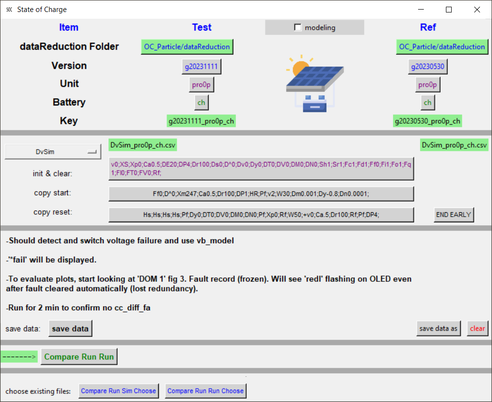
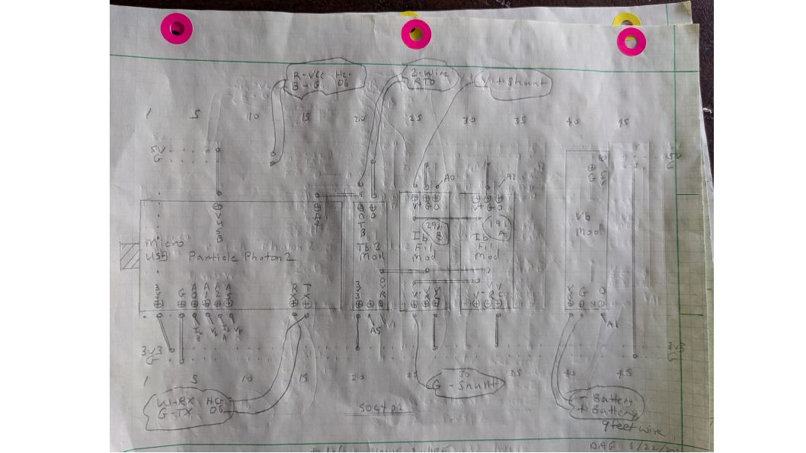

# mySolarStateOfCharge

**A reliable, fault-tolerant State of Charge (SoC) monitor for LiFePO4 battery banks**, built around the Particle Photon2 microcontroller.  Combines Coulomb Counting with an Extended Kalman Filter (EKF) and dual current sensing to deliver accurate, self-calibrating energy monitoring even in the presence of sensor failures.

Originally designed for truck and RV camping with a CPAP machine — "I've never woken up gasping and I want to minimize that possibility."

---

## Quick Start

```
git clone https://github.com/davegutz/mySolarStateOfCharge
```

See the [Installation Guide](SOC_Particle/INSTALL.md) for VS Code + Particle Workbench, PyCharm, and puTTY setup on Linux and Windows.

---

## Screenshots

### Python GUI — GUI_TestSOC.py



*The Python GUI automates puTTY sessions, data capture, and run-vs-simulation overplotting.*

### Hardware Board Layout (Photon2)



*Stripboard layout showing Photon2, OPA333 op-amp current sense circuits, voltage divider, and 1 Hz anti-alias RC filters.*

---

## How It Works

The flat voltage-SoC curve of LiFePO4 batteries makes voltage alone useless as a fuel gauge.  This system uses:

- **Coulomb Counting** — integrates bipolar shunt current at 10 Hz to track charge directly
- **Extended Kalman Filter (EKF)** — estimates SoC from voltage + temperature; detects and isolates sensor faults
- **Dual current sensing** — two OPA333 op-amp circuits at different gains (HI/LO range selection) create virtual triplex redundancy when combined with the EKF
- **Hysteresis model** — tracks the large VOC hysteresis of LiFePO4 to improve EKF accuracy
- **Retained SRAM** — fault snapshots and 30-minute history survive power cycles
- **BLE interface** — native Photon2 BLE for wireless monitoring; no phone dongle required

Battery saturation (full charge) is detected reliably and used to re-calibrate the Coulomb Counter automatically.

---

## Repository Structure

### [`SOC_Particle/`](SOC_Particle/README.md) — Main Application

The primary Particle Photon2 firmware and companion Python tools.

| Subfolder | Contents |
|-----------|----------|
| `src/` | Firmware source — `SOC_Particle.ino` and all C++ modules |
| `pyStateOfCharge/` | Python GUI (`GUI_TestSOC.py`) and data reduction scripts |
| `dataReduction/` | Captured puTTY data files and puTTY session config |
| `datasheets/` | Hardware datasheets, research documents, pSpice models |
| `Battery State/` | Theory documents, EKF derivation, Python sandbox models |
| `doc/` | Installation guides, functional block diagrams, schematics (hand-drawn + LTSpice), test procedures |
| `lib/` | Particle-managed third-party libraries |

Key documents inside `SOC_Particle/`:

- [Full Installation Guide](SOC_Particle/INSTALL.md) — VS Code, Particle Workbench, PyCharm, puTTY
- [Application README](SOC_Particle/README.md) — architecture, calibration, Talk interface, FAQ
- [Test/GUI Interface](SOC_Particle/doc/TestSOC.md) — how to use `GUI_TestSOC.py` with puTTY
- [Calibration Guide](SOC_Particle/Calibrate20230513.odt) — step-by-step calibration procedure

---

### [`eeprom_test/`]— EERAM Test (Argon)

Test project for the 47L16 EERAM I2C module used on the Particle Argon to provide battery-backed parameter storage.  Superseded on Photon2 by `retained` SRAM, but kept for reference.

---

### [`ble-uart-peripheral/`](ble-uart-peripheral/src/) — BLE UART Peripheral

Standalone BLE UART peripheral example used during bring-up of the Photon2 native BLE interface that replaced the HC-06 Bluetooth module.

---

### [`SOC_Sense/`](SOC_Sense/) — Sense Module Experiments

Early experiments with alternative sensor front-end designs, including direct ADC sampling without the OPA333 op-amp stage.

---

## Hardware Overview

| Signal | Photon2 Pin | Notes |
|--------|-------------|-------|
| Ib amp (primary) | A0 / D11 | OPA333 high-gain output, 1 Hz LPF |
| Vb battery voltage | A1 / D12 | 20k/4k7 divider + 1 Hz LPF |
| Ib noa (backup) | A2 / D13 | OPA333 low-gain output, 1 Hz LPF |
| Vc reference | A5 / D14 | Op-amp common voltage |
| Temperature | D3 | DS18B20 one-wire (or 2-wire thermistor on A3/D0) |
| Status LED | D7 | Heartbeat, toggles each publish frame |
| USB / BLE | — | Dual output: all Serial also sent to BLE notify |

Power supply: 12 V battery → LM7805CT → 5 V (VIN) → Photon2 internal → 3.3 V for op-amps and sensors.

---

## License

[MIT License](SOC_Particle/src/SOC_Particle.ino) — Copyright © 2024 Dave Gutz
Repository: [github.com/davegutz/mySolarStateOfCharge](https://github.com/davegutz/mySolarStateOfCharge)
Contact: davegutz@alum.mit.edu
