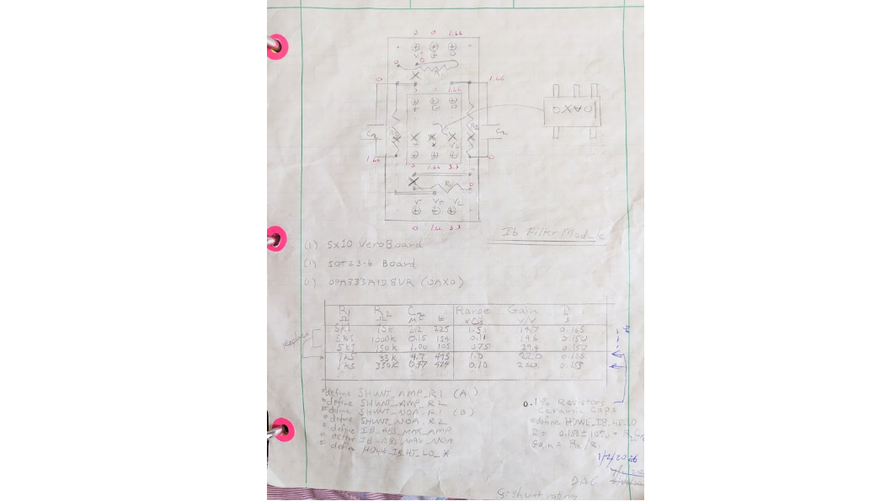
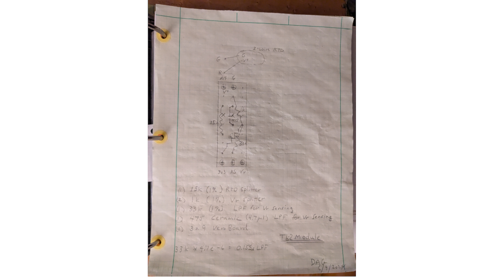
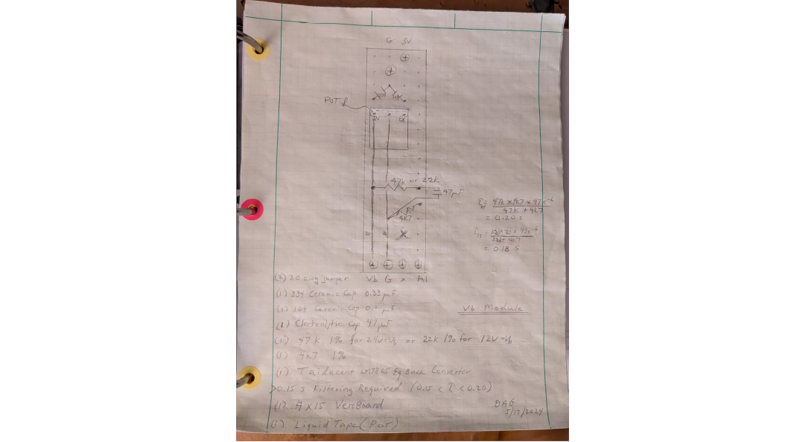

# State of Charge Monitor

A Particle Photon 2 application that uses temperature, voltage, and bipolar current measurements to reliably monitor the state of charge (SoC) of a domestic LiFePO4 battery bank charged by various sources (solar, alternator, shore power).

> **Quick links**
> - **[Quick Start Guide](README_QuickStart.md)** — complete end-to-end setup on Linux, Windows, and macOS
> - **[Technical White Paper](README_WhitePaper.md)** — survey of the state of the art in SoC estimation and how this project fits in

<!-- TOC -->
* [State of Charge Monitor](#state-of-charge-monitor)
  * [Abstract](#abstract)
  * [Algorithm Overview](#algorithm-overview)
  * [Off-the-Shelf Hardware Description](#off-the-shelf-hardware-description)
  * [Software Installation](#software-installation)
  * [Requirements](#requirements)
  * [Assumptions](#assumptions)
  * [Battery Unit Concept](#battery-unit-concept)
  * [Repository](#repository)
  * [Prototypes](#prototypes)
  * [User Interface](#user-interface)
  * [Synchronization and Initialization](#synchronization-and-initialization)
  * [Fault Detection and Reliability](#fault-detection-and-reliability)
  * [Post-Process Monitoring](#post-process-monitoring)
  * [Battery Heating](#battery-heating)
  * [Hardware Notes](#hardware-notes)
  * [Software Notes](#software-notes)
  * [Calibration](#calibration)
  * [Boot Checklist](#boot-checklist)
  * [Throughput](#throughput)
  * [Dynamic Randles Model](#dynamic-randles-model)
  * [Dynamic Hysteresis Model](#dynamic-hysteresis-model)
  * [Coulombic Efficiency](#coulombic-efficiency)
  * [Battery Cyclic Life](#battery-cyclic-life)
  * [Implementation Notes](#implementation-notes)
  * [Powering Your Device](#powering-your-device)
  * [Redo Loop](#redo-loop)
  * [Device Interfaces](#device-interfaces)
  * [FAQ](#faq)
  * [Changelog](#changelog)
  * [References](#references)
  * [Appendix 1: Nomenclature](#appendix-1-nomenclature)
  * [Appendix 2: Links](#appendix-2-links)
<!-- TOC -->


## Abstract

Users of rechargeable battery banks need to know how much charge remains — the "gas-gauge replacement" problem. In my case, when truck camping with a CPAP machine, I need confidence that the RV battery bank will run the CPAP through the night. Older lead-acid batteries have a steep voltage-vs-SoC curve, so a simple voltmeter works as a gauge. Modern LiFePO4 batteries — efficient, safe for sleeping quarters, and now the standard for RV and marine use — have a flat voltage-vs-SoC curve. Worse, their voltage hysteresis (the difference between charging and discharging at the same SoC) is large compared to the SoC-driven voltage variation, so voltage alone cannot be used to estimate SoC.

A smart, reliable monitor is therefore needed. *Smart* means it tracks current-vs-time history accurately enough to predict run time remaining at the current load. *Reliable* means it stays operational through common sensor failures and lets the user repair on their own schedule with no downtime. The known condition of full saturation — easy to detect from voltage and charge current — provides a natural, repeatable reference that can recalibrate the device on the fly. Hardware RC low-pass filtering (1 Hz -3 dB) cleans noise injected by AC inverters; because SoC is a long-term integration (effectively a very slow filter), no software lowpass filtering is needed for Coulomb counting. An Extended Kalman Filter (EKF) is included not for SoC accuracy but to provide an independent voltage-based estimate used for fault detection, isolation, and recovery.

Reasonable reliability is achieved with simplex temperature sensing, simplex voltage sensing, and dual current sensing. The combination of two current signals, one voltage signal, the EKF, and the known voc(soc) characteristic gives the equivalent of triplex current sensing. Quiet-signal detection identifies a disconnected or failed current sensor. For strictly hardware reliability, all sensor components are line-replaceable on a prototype breadboard.

Faults and SoC history are recorded in retained SRAM (Photon 2) for later retrieval. A standalone Python data-reduction program (DRP) overlays history on a model to verify behavior and serves as a regression machine. Key learnings: the system needs ~0.1 s update to capture current peaks and valleys by integration; the EKF needs double precision and a slower (~2 s) update rate to handle numerics gracefully; reasonable simple scalar-and-bias calibration of the installed current sensor against a clamping ammeter is sufficient to predict time-remaining within about 30 minutes.

Battery cyclic-life effects are negligible at the depth-of-discharge and cycle count typical for this use of LiFePO4.


## Algorithm Overview

The core SoC estimator is a Coulomb Counter: charge is integrated from sensed current over time. Two independent corrections keep this honest:

**1. Saturation reset — the primary cleansing agent.** A Coulomb counter, by itself, drifts indefinitely from any small bias in the current sensor. The fix is periodic resync to a known state. The LiFePO4 full-charge state is uniquely recognizable: when filtered voc rises above `CHEM_NOM_VSAT` (≈13.85 V per 12 V unit, temperature-corrected via `BATT_DVOC_DT ≈ 0.001875 V/°C`) with current entering, the battery is declared saturated. On saturation, `q` is reset to `q_capacity` and `delta_q` (charge deficit since last saturation) is set to zero. Because most installations reach full charge most days, drift is bounded by the time between saturations, not by sensor lifetime. All internal book-keeping is expressed as `delta_q` (charge debited *since last known saturation*) so this reset is the natural origin of the computation.

**2. EKF cross-check and recovery.** An Extended Kalman Filter solves the voc(soc) characteristic in reverse: given measured voltage (and the Randles dynamics + hysteresis offsets), it estimates SoC. The EKF runs slower (~2 s update) at double precision. It exists primarily for *fault detection*: when CC and EKF diverge beyond `DF1` the displayed SoC is weighted toward the EKF, beyond `DF2` (~20 %) it switches to the EKF, and after 30 s with > 5 % error the Coulomb counter is reset to the EKF.

**Reliability through redundancy.** Two physical current sensors (an amplified low-range channel `Ib_amp` and a no-amp wider-range channel `Ib_noa`) plus the EKF/voltage-derived estimate form effective triplex current sensing. Logic compares:
- **Hard range checks** — each sensor against its `IB_ABS_MAX`
- **`ib_diff`** — slow disagreement between amp and noa (catches small bias drift)
- **`ib_wrap` (`e_wrap`)** — predicted-vs-measured voltage using each current sensor (catches large fast failures)
- **`cc_diff`** — Coulomb-counter divergence between amp and noa over time
- **`ib_quiet`** — neither sensor sees activity (catches disconnects)
- **`vb_check` / `vc_check` / `Tb_check`** — voltage/reference/temperature range

Fault outcomes feed decision tables (see `DecisionTables.md`) that select the active Ib and Vb signals and annunciate the result on the OLED. Once a failure is isolated, the user is expected to repair at their convenience; the system continues with the surviving signals.

**Filtering philosophy.** A 1 Hz first-order RC anti-alias filter (R·C = 0.159 s) sits in hardware on every analog input. Its job is to reject the 60 Hz pulse noise produced by the AC inverter regulator before the ADC sees it. Because SoC itself is integrated over hours, additional software smoothing of current is unnecessary and would only add lag. The Randles RC states inside the EKF capture the small-scale battery dynamics needed for the voltage-based estimate to track during transients.


## Off-the-Shelf Hardware Description

The application runs on a Particle **Photon 2** programmable logic controller (PLC). Buy the developer kit — it comes with headers, USB, and the peripherals you need. The custom interface board is built on 0.1-inch Stripboard with vertical copper traces underneath and bus-bar jumpers on top for `V+` and ground rails.

For the full parts list (with working supplier links) and the hand-drawn schematic sketches, see [parts_list_schematic.md](parts_list_schematic.md).


**Fig.1** — State of Charge wiring diagram board layout.

The Particle device name is assigned through the Particle App in Setup mode (hold MODE for 3 s for blinking blue).

**Current sensing.** A Bayite 100 A / 75 mV shunt provides the bipolar low-voltage signal. Two OPA333 op-amp circuits (configured for ~20× gain, biased at 3v3/2) convert the ±0.075 V shunt signal into 0–3.3 V single-ended signals — one is the high-gain amplifier path (`Ib_amp`), the other the no-amplifier wider-range path (`Ib_noa`). 0.1 % resistors are required; 1 % resistors produce visible drift that looks like hysteresis. A shielded sense pair from the shunt feeds high-impedance inputs to avoid ground-loop pickup. A reference channel (`Vc`) samples the 3v3/2 divider directly so the differential is computed in software.

**Voltage sensing.** A simple resistor divider drops battery voltage into the 0–3.3 V ADC window. **Caution:** exceeding 3.3 V on a Particle ADC pin destroys the input. For a 24 V (2S) system, the low leg of the divider must be reduced.

**Temperature sensing.** A DS18B 1-Wire sensor reports battery temperature with plenty of resolution for the very slow thermal dynamics of a battery bank.

**Display.** A small I²C OLED summarizes SoC, current, voltage, temperature, and signals fault status by flashing — every fourth update for a minor fault, every other for a major fault requiring action.

**Connectivity.** Native BLE on the Photon 2 replaces the HC-06 used on earlier prototypes; any standard Bluetooth Serial terminal works. USB serial is the primary debug interface.

**Power.** A 12 V → 5 V converter feeds the Particle device and the 1-Wire sensor; the Particle device supplies 3.3 V to the op-amps, EERAM (Argon-era only), and OLED. The system also runs entirely from USB, useful for bench testing — only the 12 V supply measurement is missing in that mode.

All hardware is the least expensive that meets requirements. Battery uncertainty dominates accuracy, and the build volume is one or two units, so user calibration replaces precision components.

The first prototype was a Battleborn 100 Ah LiFePO4 battery — expensive but with an industry-leading BMS. Chins batteries at roughly 1/3 the price are also supported by recompilation.


## Software Installation

[**Complete Installation Guide — VS Code, PyCharm, puTTY (all platforms)**](INSTALL.md)

Platform-specific supplements:
- [Windows Software Installation](doc/InstallationWindows.md)
- [Linux Software Installation](doc/InstallationLinux.md)
- [macOS Software Installation](doc/InstallationMacOS.md)


## Requirements

Perceived requirements, many discovered through testing. They are documented here to record intent.

1. Calculate SoC of a nominal 100 Ah LiFePO4 unit as a percentage of rated capacity.
   - Actual capacity may exceed rating slightly (≤ 105 %).
   - Displayed SoC may exceed 100 % but must not go below 0 %.
2. Display steady values during DC-only operation (no inverter) after filter rise.
   - Estimate and display hours-to-empty (charge positive). This is the main use case: assuring the sleeper that the CPAP will outlast their sleep.
   - Display shunt current (charge positive), battery voltage, and battery temperature.
3. Provide a `Talk` text command interface able to:
   - Set the SoC state.
   - Separately set the model state.
   - Reset essentially any state.
   - Inject test signals.
4. Hard and soft CPU resets must not change long-term state — SoC, display, or serial bus.
5. Serial streams must include absolute Julian time for plotting and comparison.
6. A built-in test capability, engaged through `Talk`.
7. Flash via USB. Wi-Fi to phone/truck hotspot may be unreliable in the field. Provide physical access to the Particle's MODE and RESET buttons.
8. Monitor via USB from a laptop or phone. `Talk` chooses verbosity and can inject signals for debugging.
9. The device shall have no effect on the monitored system. Monitor function only.
10. Bluetooth serial interface required. OLED displays have short life and need an adjustment tool.
11. Maintain a rolling summary of SoC every half hour (Tb, Vb, soc) in battery-backed memory; print on boot and on `Talk('Hs')` request.
12. `Talk`-driven adjustments to either model or monitor must preserve `delta_q` between them (preserves charge accounting through manual interventions).
13. The `Talk` interface is allowed to be quirky — initialization is tuned for normal operation, not for testing. Document the quirks rather than complicating initialization.
14. Provide hardware current-signal injection for in-circuit testing (PWM from the Particle into the shunt-input RC network via a jumper).
15. Provide a built-in model (`Sim`) to drive logic, run regressions, and exercise the EKF — including saturation entry/exit and zero-charge limits.
16. The Battery Monitor is not required to predict saturation precisely; the prime requirement is to count Coulombs and reset at saturation. A conservative early-saturation trip is acceptable (displays lower SoC than actual).
17. The Battery Model (`Sim`) implements a current cutback approaching saturation to mimic a real BMS.
18. The Battery Monitor predicts loss of capacity with temperature. The Battery Model may also.
19. The Battery Model is scaleable via `Talk` for capacity. The Battery Monitor has a nominal size and is OK to recompile.
20. The Battery Model Coulomb-counting algorithm is implemented as a separate class so logic changes in the Monitor don't confound regression tests.
21. `Talk('RR')` resets all logic to the installed configuration.
22. Default sensor-bias values remain as defaults in the code (no silent overrides).
23. Power loss and resets must not affect long-term Coulomb counting. Critical state lives in retained SRAM.
24. `soc = q / q_capacity(Tb)`. `SoC` (capital) is `q / q_rated_at_rated_temp`.
25. Coulomb counting tracks temperature changes to keep aligned with capacity estimates.
26. The monitor must remain benign when a DC-DC charger raises Vb while the BMS has shut off current (don't declare a false saturation).
27. Multiple chemistries supported by `#include` / `Talk('Bm')`; nP and nS scale the bank.
28. Bank configuration shall be fully adjustable on the fly through `Talk` — no recompile required to switch between supported chemistries.
29. Maximize availability under sensor faults. Faults annunciate on the display; print details via `Talk('Pf')`. Faults may be masked through retained parameters.
30. No battery cyclic-life logic is required for LiFePO4 in this duty cycle.
31. The `Talk` interface supports timed and freeze/release controls so long scripts can be chained.


## Assumptions

1. Randles 2-state RC + RC linear battery dynamic model.
2. Hysteresis model — one of:
   - 1-state RC lag with variable resistance, constant capacitance, and limited authority (physics-based "Boundary Synthesis B" derivative); or
   - Keras LSTM recurrent neural net with inputs `Tb`, `ib`, `soc`.
3. Industry-standard `voc(soc)` table characteristic per chemistry.
4. Battery has a Coulombic charging efficiency `coul_eff` typically very close to 1.
5. Coulombic efficiency relates to Randles resistances (loss appears as heat in `r0`, `r_ct`, `r_dif`).
6. All current entering the series Randles + hysteresis chain ends as charge once the battery settles; transient state in the Randles and hysteresis capacitors is bookkept by the Coulomb counter as long as we wait for steady state, which we always do.
7. Sensor calibration is treated as perfect after install; residual error is documented as an accuracy budget item.
8. Fractional change of SoC of +0.01 per °C of bank temperature change.
9. New batteries have capacity up to 105 % of rating.


## Battery Unit Concept

All modeling is performed on a 12 V battery "unit" with a chemistry-specific `voc(soc)` characteristic and rated Ah capacity. Multi-battery banks are configured by floating-point `nP` (parallel) and `nS` (series) — a 2S3P bank is 4 batteries with 2× voltage and 3× current. Scaling occurs at the sensor interface and at the display interface; the model and counter operate on a single unit.

**Caution — voltage sensor scaling.** The 3.3 V ADC measures up to ~15 V via a resistor divider. Adding series batteries requires reducing the low leg of the divider. There is a way to add the parallel resistor on the back of the main PLC board accessed by removing the cover. Remember to rescale and recalibrate `VB_SCALE` after any change.

**Current sensor design.** A 0.075 V / 100 A shunt with bipolar current and a 0–3.3 V unipolar ADC requires a differential amplifier and a 3v3/2 bias. A single OPA333 with ~20× gain matches both the shunt range and the ADC range; an output 1 Hz RC filter doubles as anti-alias for op-amp and inverter noise. For reliability the design uses two amplifier paths: a higher-gain "amp" path for fine resolution at light loads (where the system spends most of its time) and a wider-range "noa" path for charge events and surge currents. The single voltage sensor casts the third vote through the EKF, giving effective triplex current sensing without a third shunt.


## Repository

All source, datasheets, scripts, and documentation live in <https://github.com/davegutz/mySolarStateOfCharge> under MIT license.

Top-level layout, alphabetically:

- **Battery State/** — Theory of LiFePO4 SoC monitoring. Subfolder `EKF/` contains EKF theory; `EKF/sandbox/` contains Python prototypes.
- **dataReduction/** — Raw puTTY captures (`.txt`), hand-plotted spreadsheets (`.xls`/`.xlsx`/`.ods`), puTTY configurations (`.stc`), and a `figures/` archive of regression run plots.
- **datasheets/** — Hardware datasheets, hand-drawn schematics in `Schematics/`, LTSpice models in `pSpice/`, and Rigol scope captures.
- **doc/** — Schematics images, installation guides, and assorted notes referenced from this README.
- **lib/** — Particle Workbench imported libraries.
- **pyStateOfCharge/** — Python data-reduction code (`GUI_TestSOC.py`, `CompareRunRun.py`, `CompareRunSim.py`, `CompareHistSim.py`, `CompareFault.py`, etc.) plus the `pyDAGx/` helper library.
- **src/** — Application source. The entry point is `SOC_Particle.ino`. Subfolders: `Adafruit/` (hand-imported libraries), `hardware/` (miscellaneous device drivers), `myLibrary/` (custom dynamic-filter and EKF utilities), `talk/` (`Talk` command handlers).
- **target/** — Generated `.elf` files from Particle Workbench builds.

**Design process philosophy.** Verification is centered on the *overplot*: data from a new run is overlaid on the corresponding model run, and on previous regression runs. A perfect overlay is the success criterion; deviations get explained. This keeps documentation lightweight — when the plot matches, the design meets intent.


## Prototypes

Two situations drove design choices.

**Shunt sampling.** The most challenging hardware problem is sampling the low-voltage bipolar shunt. The first prototype used the ADS1013 differential ADC over I²C, later augmented with an OPA333. The I²C bus turned out to dominate throughput (10–100 ms per read), so the design moved to the Particle's onboard ADCs feeding amplified single-ended signals. The ST `TSC2010-IDT` differential amplifier chip (20× gain, perfect for this application) would simplify the design further but was unavailable during COVID; the current design carries the dual-amplifier approach.

**Particle platform evolution.** The Photon 1 had Wi-Fi and built-in EEPROM but is no longer in production. The Argon added BLE but lost the EEPROM, requiring an external 47L16 EERAM. The current target is the **Photon 2**, which has BLE and retained SRAM — replacing the EERAM and the HC-06 Bluetooth adapter used on earlier prototypes. Code paths for pre-Photon-2 hardware are being phased out.

Software toolchain evolves continuously. The application is simple enough that no firmware-version-specific bugs have blocked it; the policy is to track the latest stable Device OS as it releases.


## User Interface

Three real-time access methods, all using the `Serial` API set:

- **puTTY over USB** — primary interface for testing and data collection.
- **Phone UART terminal over USB** — useful when mobile.
- **Bluetooth Serial Terminal over BLE** — daily quick check; reproduces the OLED display at `vv0`.

`Serial` (USB) carries all heavy troubleshooting and tests. `Serial1` (BLE) carries a subset. Verbosity is selected with `vv<N>`; type `h` for the command list. See [doc/TestSOC.md](doc/TestSOC.md) for detailed `Talk` usage.

**GUI_TestSOC.py** is a tkinter wrapper around puTTY that automates regression: it starts puTTY, ships a regression macro to the clipboard for paste-in, manages the data-collection folder, backs up captures, then runs `CompareRunRun.py` / `CompareRunSim.py` to produce overplots.


**Fig.2** — Functional block diagram of the user interface.

**Tips:**
- On first startup the device may be in setup-prompt mode; clear that before any paste.
- Retained SRAM is updated every 10 s; depowering before then loses recent `Talk` changes.
- During initialization, the application emits `*` characters until the parameter store is stable. Those asterisks corrupt the data stream and cause `None` errors in the GUI; wait until they stop.
- Reset the puTTY timer immediately after pasting a regression macro.


## Synchronization and Initialization

This is real-time scheduling, not clock time.

**Loose synchronization.** Each call to `loop()` ticks timers that gate the frame logic. If a frame is delayed by other work, the next frame catches up. This is acceptable because the application has no closed-loop feedback control — it integrates current over hours. The library of dynamic difference-equation filters recalculates coefficients each pass for the *measured* update time, so glitches are absorbed rather than amplified, as long as actual update time stays within each filter's stable range.

**The over-plot consequence.** Captured data drives the off-line model. Because the model also computes coefficients from the same logged update time, any time glitch in the device reproduces identically in the model — making the glitches invisible in the over-plot. This is desirable: it means the over-plot tests modeling fidelity rather than scheduling fidelity.

**Initialization.** Dynamic algorithms need a sensible initial state. On power-up, the first few passes sense initial conditions and iterate "use-before-calculate" chains. `initialize_all()` attempts to do this in one pass. The DS18B 1-Wire temperature sensor can take up to a minute to deliver its first reading; a `reset_temp` flag stretches initialization until a good Tb arrives, then rate limits guard against latency-induced spikes. Re-initialization on the fly is triggered by `Talk` operations that change SoC, model state, or selections — `cp.soft_reset` flips the appropriate `reset` flags.

**EKF re-initialization.** A solver iterates `voc(soc)` to find the initial SoC consistent with measured voltage. Used only on hard boot or after a `Talk` SoC adjustment. Convergence persistence (`TFDelay(false, ...)`) starts false so the EKF cannot prematurely re-initialize the Coulomb counter.

**Saturation as a sticky bit.** Because `saturated` is a use-before-calculate signal in `count_coulombs()`, the call passes a `resetting` flag forward so the function sets its `resetting_` sticky bit on exit, breaking the algebraic loop.

**Off-line model initialization.** The over-plot model initializes directly from the incoming data stream rather than running its own initialization sequence. Reset flags in the stream tell the model when to do this.


## Fault Detection and Reliability

See [DecisionTables.md](DecisionTables.md) for the full decision tables that drive sensor selection and annunciation, and [Fault_Tests.md](Fault_Tests.md) for the regression macros that exercise the critical-signal failure paths and the documented coverage gaps. The Hi-Lo strategy (high-gain amp + wide-range no-amp) is the active selection scheme; an Active-Standby scheme is kept in source for reference.

**Concept.** A failed sensor either has obviously out-of-range output (easy) or quietly returns wrong numbers (hard). The first is caught by range checks. The second is caught by *cross-checks against redundant signals*. With one voltage sensor, one temperature sensor, and two current sensors:

| Cross-check | Detects |
| --- | --- |
| `ib_diff` | Slow disagreement between amp and noa current sensors. |
| `ib_wrap` (`e_wrap`) | Rapid disagreement between measured Vb and Vb predicted from the selected Ib through the Randles + hysteresis model. |
| `cc_diff` | Long-term divergence between the Coulomb counter and the EKF (or between the two CCs). |
| `ib_quiet` | Both current sensors flat for `QUIET_SET` ≈ 60 s — disconnected or shunt failure. |
| `vb_check` | Vb out of range, or Vb very low with Ib above `IB_MIN_UP` (catches BMS shut-off ambiguity). |
| `vc_check` | Op-amp 3v3/2 reference out of range — both current paths invalid. |
| `Tb_check` | Tb out of range or stale. |

**Annunciation.** Every fault changes the display so the user notices. Minor faults blink every fourth update; major faults blink every other. The user runs `Pf` to read the cause.

**Failure isolation philosophy.** Once isolated to one bad sensor, further "is it really still bad?" filtering provides little value — like choosing between two wristwatches showing different times. The expected response is *physical repair* at the user's convenience. The system continues with the surviving signals; exposure to a second simultaneous failure is small in absolute terms over a repair cycle.

**Fake-fault mode.** `Ff1` makes fault detection record the trip but skip the protective response. This is useful for regression and verification — exercise the detection path without forcing the system into a degraded selection.

**Sensor sizing.** `Ib_amp` (high-gain, ~10 A typical range) targets the long-duration low-current phases. `Ib_noa` (wide-range) targets the short charge surges. Wrap thresholds are tuned for `~0.2 V = 16 A` (with extra margin near saturation for the voc inflection there) and have been validated to detect failures slower than `C/0.16` and faster than `1C`.

**Power loss is a normal event.** Both the user and the BMS deliberately power the device off (BMS shuts off charging below 0 °C and discharging below ~10 V). Long-term Coulomb counting is preserved in retained SRAM. Faults and history are also retained.


## Post-Process Monitoring

Once high-rate current integration is verified in commissioning, routine monitoring can sample very slowly. Two circular buffers in retained SRAM/PRAM manage this:

- **SUM** (`NSUM`-deep) — half-hour SoC snapshots (`Tb`, `Vb`, `soc`, faults).
- **FLT/SLT** (`NFLT`/`NSLT`-deep) — seven-point fault snapshots, frozen on any critical sensor fault until manually cleared (`HR`/`Rf`).

All buffers are downloadable through any of the three monitoring interfaces. Photon 2 retained SRAM and PRAM provide the storage; excess capacity goes to history depth.

**Resistor tolerance.** Field temperature range (~0 °C heated battery to ~40 °C summer ambient) drives only about 1 % drift in 5 % resistors. Hysteresis, life, and calibration uncertainty dominate accuracy, so the resistors don't need to be precision parts — but 0.1 %, 1/4 W resistors are negligibly more expensive and are recommended in new builds.


## Battery Heating

LiFePO4 batteries are damaged by charging below 0 °C, and BMS units shut off charging there. By heating the battery from solar or alternator power, the bank can stay available even when outside temperatures drop well below freezing. The practical floor for this is roughly −5 °F; colder than that, the battery spends its capacity keeping warm and has nothing left for the CPAP.

Heating pads wrap the sides of the battery (not the bottom — see Implementation Notes). A controller, marketed for chicken brooders, watches a thermistor inside the wrap and switches battery power to the heaters with adjustable hysteresis. 40–45 °F (4.4–7.2 °C) works well; Battleborn's published guidance is 35–45 °F. The monitor's temperature sensor sits next to the heater sensor inside the wrap. See [battlebornbatteries.com — heat-pad usage](https://battlebornbatteries.com/faq-how-to-use-a-heat-pad-with-battle-born-batteries/).

A separate Python study (`Battery State/EKF/sandbox/GP_battery_warm_2022a.py`) modeled an earlier attempt that put heat at the bottom with the sensor on top, producing severe overshoot and localized melting. Lesson: heat from the sides, sensor and heater inside the wrap together.


## Hardware Notes

- All grounds tied to the solar ground and to the chassis.
- Routine data is collected with a laptop on the inverter, USB-connected to the Photon.
- 500 W discharge testing uses a floodlight via inverter; 500 W charge testing uses the alternator DC-DC converter (engine running, breaker under hood).
- **Do not connect a laptop to an external AC supply while monitoring** — ground-floating laptops bias ADS inputs into the Schottky diodes and corrupt the current reading. (Pre-Photon-2 ADS-based prototypes only; mentioned for legacy users still on Argon/Photon 1.)


## Software Notes

Particle build / runtime gotchas:

**Heap fragmentation.** The Particle build allocates a fixed heap for `new/delete` and `String +=`. With long `Talk` strings, the `String +=` accumulator can overflow heap silently and drop characters. Allow about 8 bytes of headroom in `NSUM` below the value that compiles cleanly. The application now checks the worst offenders and prints `FRAG` on the serial console; the typical fix is reducing `NSUM` in `constants.h`.

**Decision Tables.** The fault logic and sensor-selection decision tables are generated by `gen_decision_tables.py` from `DecisionTables.ods` into `DecisionTables.md`. Regenerate after editing the spreadsheet.


## Calibration

Battery-monitor accuracy is dominated by current-sensor calibration and the battery's own characterization. Two stages:

**1. Bench calibration of the current sensor.** Before install:
- Use a regulated power supply through the shunt and a clamping ammeter to measure slope (1333 A/V nominal for a 100 A / 75 mV shunt). Set `CURR_SCALE_AMP` / `CURR_SCALE_NOA`.
- Bias is determined by a discharge-charge cycle: integrate A over the cycle and adjust `CURR_BIAS_*` so endpoint equals start point at saturation. The cycle also yields a practical battery capacity estimate.

**2. Calibration checklist after install:**
1. `Dv` delta adjustment to align measured Vb with a meter on the battery posts.
2. Tb needs no adjustment. If a heater kit is fitted, ensure Tb is inside the wrap next to the case.
3. Collect data over the full operating range — full discharge to full charge — at roughly C/3 (≈30 A for a 100 Ah unit):
   - Hardware: clamping multimeter at the shunt, multimeter on Vb.
   - Software: log `Ib_amp`, `Ib_noa`, and `Vb`.
4. Plot in a spreadsheet, fit a first-order polynomial. Linearity should be excellent — anything else means a wiring or grounding issue.
5. Repeat with the battery heater to capture `voc(soc, Tb)` and verify capacity (which should be ≥ rated).
6. Temperature dependence on shunt calibration has not yet been observable at the precision of this build.

**Saturation set-point.** Filtered `voc = vstat_f > CHEM_NOM_VSAT` (≈13.85 V, temperature-corrected) approximates SoC > 99.7 %. Temperature correction is `BATT_DVOC_DT ≈ 0.001875 V/°C × cell_count` (4 cells per 12 V unit), derived from the Battleborn characterization data.

**Tweak option.** A `Tweak` class is preserved in the source tree (`Tweak.cpp.sav`) that compares CC charge history between saturations to infer bias drift. It is not active — added complexity for marginal benefit at this build's precision.


## Boot Checklist

After a new software load:

1. **Synchronize time** if needed. Use the phone hotspot to add the device in the Particle app, then use `Talk('UT')` (or the GUI's UT button) to push a Unix-Epoch time minus the local UTC offset. Time is stored in UTC.
2. **Update the software version** in `version.h`.
3. Start a puTTY record. Capture `Hd`, `Pf`, `Pa`, and a short `vv1` burst from the *previous* load.
4. On restart after flash, check the retained-parameter list (printed automatically). Go carefully if you've been tuning — old retained values may pollute the new build.
5. Repeat `Hd`, `Pf`, `Pa`, `vv1` for the new load. Confirm `unit =` matches the intended target.
6. Confirm faults are clear (`Rf`), history is clear (`HR`), modeling is off, UT is set, and `soc` and `soc_ekf` are reasonable before walking away from the installed system.


## Throughput

- **Driver of throughput** is sensor read and EKF update, not the main loop.
- **Quick check:** `vv99` prints CPU usage in the far-right column. Best simple measurement: `Dr1;DP100;vv1;` and watch `dt`.
- A `Serial.printf` statement costs ~4 ms. A `vv4` burst on USB can starve frames.
- The hardware AAF filters mean nothing above ~5 Hz needs to make it through; running the main loop at 10 Hz (`READ_DELAY = 100`) leaves plenty of margin.
- The EKF runs every `EKF_EFRAME_MULT` main frames — at `READ_DELAY = 100` that's 2 s.
- A 6 × 1.2 ≈ 7 s delay separates a transient and its EERAM/SRAM commit. Rapid button-pushing in test scripts can read stale retained values.

**Throughput verification:**
```
vv1;Dr1;        # confirm minor-frame slack: T print, estimate X-2σ value (~0.049 s, ≈50 % margin)
Dr100;          # confirm T restored to 0.100 s
```


## Dynamic Randles Model

The Randles model is a 2-state lumped equivalent circuit: a direct DC resistance `r0` in series with two parallel R-C branches (`r_ct`/`tau_ct` for charge transfer, `r_dif`/`tau_dif` for diffusion) feeding the open-circuit voltage `voc`. It is implemented in `Battery.cpp/h` and reused in both the Monitor and the Sim. Parameters come from chemistry-specific tables in `Chemistry_BMS.cpp`. A scalar `sres_in` is available for off-line tuning of all Randles resistances together.

The EKF embeds the same Randles dynamics so that the model's transfer function from measured `ib` to predicted `vb` is consistent between the Monitor and the Sim — necessary for `e_wrap` faults not to fire on legitimate transients. If the actual sample interval exceeds `RANDLES_T_MAX`, the Sim's Randles bypass kicks in to avoid numerical oscillation; the same bypass is reflected in the Python over-plot so behavior matches between device and model.

Whether the Randles dynamics earn their keep in this application is an open question. SoC is the integral of `ib` over hours; that integration is itself a very slow low-pass filter that absorbs most of the small-signal behavior the Randles model captures. The dynamics matter for the EKF's `vb` prediction during fast charge swings, but if EKF tuning is forgiving (large `R`), they may not. The honest test: run the Sim with the Monitor's Randles model disabled, run a `Tweak` regression, and see whether tweak behavior changes. Until that study is done, the Randles model stays in.

### Tuning the Dynamic Randles Model

If you have a Battleborn battery or a CHINS battery  you are in luck.  The models herein are already tuned for those (r0, rc_t, tau_ct).  And they scale properly for number of series or parallel batteries.

If you have a new type, some testing is needed.

The r0 parameter is probably easiest to tune.   For large steps in current you should see no instantaneous change in voc_stat.  Usually a single value for r0 works well, even at other temperatures.

The rc_t and tau_ct then are tuned to match long transients following steps. The values of tau_ct are typically 20 sec - 180 sec so steps followed by dwells up to 10 minutes will tease out the value of tau_ct.  The value of r_ct is the leakage decay of the battery and may not need tuning ever from the typical values used herein.  Remember this system counts on periodic saturation.


## Dynamic Hysteresis Model

Two implementations live in the tree.

**1. Physics-based "Boundary Synthesis B" derivative** — class `Hysteresis` in [Hysteresis.h](src/Hysteresis.h) / [Hysteresis.cpp](src/Hysteresis.cpp). Models hysteresis as a reservoir of "surface charge" with limited authority; resistance to charge/discharge depends on the reservoir state. It is regenerative in nature (resistance depends on built-up charge) and is consequently very difficult to tune. Because it uses voltage as an input it cannot be used to isolate a voltage-sensor failure cleanly. It is the default and works adequately.

**2. Keras LSTM recurrent neural net** — predicts `dv = voc − voc_soc` from `Tb`, `ib`, `soc` history. Automatically compensates for `voc_soc` scheduling errors because it is trained against measured `voc` derived from a working voltage sensor. Training data needs are similar to tuning the physics model but with shorter time samples (25 s vs 30 min).

Rejected variants:
- **One-hot "charging"/"discharging" inputs** — the dwell times required to fully wind up the hysteresis reservoir are too long to be practical.
- **Physics + LSTM hybrid** — would still require a tuned Synthesis model. Milking mice.
- **`soc`/`Tb` introduced after the LSTM in a later dense layer** — did not reduce LSTM complexity meaningfully; lost compensation for non-linear scheduling errors (`soc²`, `log(soc)`).

Trade studies in `NN_TradeStudies.odt`. Tools:
- [`py/CompareTensorData.py`](pyStateOfCharge/CompareTensorData.py) — selects and recalculates `soc` and `voc_soc_new` for the data files; `dAB` calibration errors are corrected against `TP` / `TN` segments.
- [`py/TrainTensor_lstm.py`](pyStateOfCharge/TrainTensor_lstm.py) — selects and tunes the LSTM. Default `subsample = 5`: for source data sampled at `T = 5` the model runs on 25 s updates. A long lag on `ib` preserves information during the long sample interval. Huber loss with `delta = 0.1` gave the cleanest fits, favoring small-error fit (which matters since hysteresis saturates).


## Coulombic Efficiency

`coul_eff` is the ratio of charge that arrives in the battery to charge that leaves the current sensor heading there. For high-quality LiFePO4 the value is typically 0.99–1.00 — the small loss appears as heat in `r0`, `r_ct`, and `r_dif`. The Coulomb counter scales charging-direction current by `coul_eff`; discharging current is passed through unchanged.

`coul_eff` is set per chemistry in `Chemistry_BMS.cpp` and adjustable on the fly through `Talk('Bc')`. Because saturation reset re-establishes truth on every full-charge event, errors in `coul_eff` show up as a small disagreement between CC and EKF that the system corrects automatically. It is therefore not a precision parameter for this application.


## Battery Cyclic Life

For LiFePO4 batteries cycling a small fraction of capacity, expected life exceeds 8000 cycles. That number was chosen by industry experts who don't actually know the limit and named the largest value at the edge of their experience. Until measurements say otherwise, cyclic life for this duty cycle is treated as undefined and is not modeled.


## Implementation Notes

Durable findings from build, integration, and field experience. Items that were time-capsule developer logs have been removed; remaining items either codify a design choice or warn about a non-obvious behavior.

**Algorithm**

1. The EKF is no more *accurate* than the underlying `voc(soc)` curves. It does, however, follow through valleys without divergence — a pleasant surprise — which is what makes it useful for fault detection.
2. The Coulomb counter is highly accurate over short windows but needs periodic recalibration to avoid drift. Saturation reset supplies that, naturally, most days.
3. The Coulomb counter is reset to the EKF after 30 s with > 5 % error from the EKF and the EKF held convergence for `EKF_CONV / EKF_T_CONV`. Initialization also uses this path.
4. Displayed amp-hours remaining is a weighted blend of EKF and CC: weighted to EKF as error rises from `DF1` to `DF2`, fully EKF above `DF2`, fully CC below `DF1`.
5. All bookkeeping is in `delta_q` (charge since last saturation). The prime requirement — periodic reset at saturation — is reflected in the choice of independent variable.
6. The Monitor does not predict saturation or low-voltage shut-off precisely. It only needs to *recognize* saturation when it happens; conservative early trips show as artificially low SoC, which is the safe direction.
7. Tb < 8 °C disables saturation monitoring to prevent false trips at low temperature.
8. The DC-DC charger can briefly hold Vb at `VB_DC_DC ≈ 13.5 V` while the BMS has cut current; the saturation check requires nontrivial charging current and so does not false-trip.
9. The fastest clean way to confirm EKF wiring is `Talk('Xm7')` (modeling on, EKF on) and verify `soc_ekf ≈ soc_mod`.

**Sampling and filtering**

10. 12-bit ADC is sufficient. Precision (bit jitter averaged over the integration window) is what matters, not absolute accuracy.
11. The hardware AAF is `R·C = 0.159 s` → 1 Hz −3 dB. Inverter pulse noise peaks near 60 Hz; AAF filtering must occur *before* the op-amp amplification so the amplifier doesn't clip and droop. See LTSpice models in `datasheets/pSpice/`.
12. C2 in both R2 legs of the differential op-amp keeps the transfer function symmetric — < $0.01 per board.
13. `READ_DELAY = 100` (10 Hz) is fast enough given the hardware AAF; further speed-up adds nothing.
14. The Argon's Serial interface was ~10× slower than the Photon and historically drove throughput planning. The Photon 2 restored fast serial; older notes about Argon-era frame slippage can be ignored.

**EKF tuning**

15. EKF `R` / `Q` are tuned for a 2.0 s update. Changing `Dr` × `DE` requires retuning. Acceptance criteria during retune:
    - `ampHiFailSlow` reaches `cc_diff = 0.004` in ~6 min.
    - `rapidTweakRegression40C` keeps `abs(soc_ekf − soc) / soc < 0.25`.
    - `0.1 < R < 1`, with `Q ≪ 1`. Behavior follows `R/Q`; doubling both gives the same response.
16. An iterative `voc(soc)` solver initializes the EKF on hard boot or after `Talk` adjustments. Convergence persistence starts false to prevent premature CC override.

**Fault logic**

17. Wrap thresholds: 0.2 V ≈ 16 A (`WRAP_HI_FA`), 0.25 V ≈ 20 A near saturation (forgiveness for the `voc(soc)` inflection). Sized so `wrap_lo_fa` trips before false-saturation with `ΔI = −100` at `soc = 0.95`.
18. Every fault must change *something* on the display. Goal: nudge the user to run `Pf`.
19. If Tb is never read on boot, fault to `NOMINAL_TB` to keep `soc` computation reasonable.
20. Loss of Vb pulls the fault logic low; a Vb pulldown resistor is not needed.
21. `cp.ts` (sample-time scalar) is used sparingly to preserve `ib_hi_lo` persistence during the slow-update GUI regression runs. Don't extend its use to other persistences.
22. `Talk('A')` re-nominalizes the retained-parameter (`rp`) structure. Used after a tuning session goes off the rails. A subsequent reset is needed for the new defaults to take effect.

**Tests and regression**

23. Run `Talk('Xp<N>,)` 0–6 off-installation to exercise inputs onto and off of saturation/zero limits. For installed regression, disconnect solar and use `Talk('Di<>')` or `Talk('Xp5')`/`Talk('Xp6')`.
24. Running the `Tweak` test pushes voc low; after about 5 cycles saturation will stop. This is an artifact of the large fast cosine input against the hysteresis model — it does not occur in real-world operation.
25. Manual initialization sanity: `Xm = 4` overrides the current sensor; `Dc<>` sets Vb where you want it; hard-reset to force re-initialization to the EKF. If the system gets stuck saturated or unsaturated, nudge with `Di<>` (positive to engage saturation, negative to release).

**Hardware lessons**

26. Float **both** legs of the shunt sense at the A/D input — do not ground the low side. In a truck install, grounding the fuse side allowed ~75 mA to flow through 20–22 AWG sense wires and introduced ~50 % error. Sense wires carry no real current as long as there is no ground loop.
27. Combining the analog commons into a single feedback at A4 increases roll-off frequency due to the shared current and creates a single point of failure. Use independent commons per current channel.
28. Use 0.1 % resistors in the op-amp dividers. 1 % produced a wander in the converted current that looked alternately like hysteresis and random walk.
29. Bluetooth: native BLE on Photon 2 is markedly cleaner than the HC-06 used previously; HC-06 disturbed Vb measurably.
30. `DS2482-RK` (1-Wire over I²C bridge) defaults to a 4-deep command stack. Under heavy Serial load this overflows and produces "moderate headroom" complaints. The library in this repo has been patched to `COMMAND_LIST_STACK_SIZE = 12`; if you update the lib, reapply the patch.
31. `readADC_Differential_0_1` (legacy ADS1015 path) had a `while-forever` wait that could deadlock under heavy serial traffic. Patched to time out; ~100–200 iterations is the sweet spot. Only relevant to pre-Photon-2 boards still using the ADS.

**Conventions**

32. Capitalized parameters denote *bank* values (e.g. for 2P3S banks). Lowercase denotes per-12 V-unit values. Yes, this violates the prevailing coding-style rule — it's a deliberate trade for readability of bank-vs-unit scaling.
33. Series banks share current through high-impedance external loads; the per-unit Randles dynamics divide voltage proportionally. Parallel banks share voltage; non-linear hysteresis is driven by identical current and divides voltage equally. Multi-battery banks therefore reduce to scalar `nP`/`nS` applied at the unit-model boundary.

**Mobile data collection**

34. Best-known Android setup: BLESerial app to capture data to file, transfer to PC for analysis. `DataOverModel.py` will run under PyDroid but live plots are flaky due to incomplete USB-serial support in the Android Python ecosystem. The path of least pain is to capture data in the field on a phone and analyze on a laptop later — or run a laptop in the truck cab inverter for both.


## Powering Your Device

The system runs either from the 12 V battery bank or from USB (phone or laptop). In service, the battery bank powers it and no USB is connected. When the BMS shuts off, the device can still be brought up from a phone or laptop USB to extract fault and history data through either Serial or BLE.


## Redo Loop

**Simple production loop:**
1. Particle Workbench → *Configure for device* → pick OS and device name (set via the Particle app).
2. Edit code.
3. With a `.h` or `.cpp` file in focus, press the **check** icon to compile.
4. Press the **lightning** icon to flash.
5. Open puTTY and `Talk`.

**When something doesn't behave (always flashes despite device-name mismatch, etc.):**
- `Ctrl-Shift-P → Particle: Clean Application and Device OS (local)`
- `Ctrl-Shift-P → Particle: Compile Application (local)` (or **Compile Application and Device OS (local)** the first time)
- `Ctrl-Shift-P → Particle: Cloud Flash` / `Local Flash` (or **Flash application and Device OS (local)** the first time)
- `Ctrl-Shift-P → Particle: Serial Monitor` or puTTY (puTTY saves data)

**Per-device settings:**

`.vscode/settings.json`:
```json
"particle.targetDevice": "<device-name>"
```

`constants.h` (via the chosen `#include "<unit>.h"`):
```cpp
const String UNIT = "<device-name>";
```

When switching between desktop and laptop, sync these two and pull the latest GitHub changes first.

**Plot results in PyCharm:**
- `CompareRunRun.py` — run-to-run overplot
- `CompareRunSim.py` — run-vs-simulation overplot
- `CompareHistSim.py` — historical-summary vs sim overplot
- `CompareFault.py` — fault snapshot vs sim overplot


## Device Interfaces

### Particle Photon 2 — assumed at least 1 A max

| Pin       | Function                          |
|-----------|-----------------------------------|
| Gnd       | Ground                            |
| 3v3       | 3.3 V supply for all peripherals  |
| VUSB      | 5 V supply for Photon 2           |
| A3 (D0)   | 1-Wire temperature sensor         |
| D7        | Status LED (heartbeat)            |
| A0 (D11)  | Primary Ib amp (`amp`)            |
| A1 (D12)  | Vb voltage sense                  |
| A2 (D13)  | Backup Ib amp (`noa`)             |
| A5 (D14)  | Vc / Vr reference voltage         |

### Voltage regulator (LM7805)

LM7805CT with input/output capacitors plus an LPF on Vb and 5 V. The series resistors (24k7) to ground and the 0.33 µF cap form an LPF matched to the Ib shunt LPF bandwidth.

- `Vi`  = 12 V from battery bank, 20k/4k7 divider to Gnd, 0.33 µF to Gnd
- `Gnd` = Gnd rail
- `Vo`  = 5 V rail

### Passive Ib shunt and Vb low-pass filters

- 1 Hz LPF built into the board.
- Use the pSpice model (`datasheets/pSpice/opa333_asd1013_5beta.asc`) to verify filter response — the OPA333 10 µF compensation cap interacts with the 1 µF filter cap.
- Goal: 1 Hz −3 dB bandwidth (the inverter noise enters at 60 Hz; SoC is effectively an integrator).


**Fig.2** — Ib filter module schematic.

### Tb 1-Wire Temperature Module


**Fig.3** — Tb 1-Wire module schematic.

### Vb Voltage Sense Module


**Fig.4** — Vb module schematic.

### Amp circuit (`amp`)

OPA333. `Vc` formed by a 4k7 / 4k7 voltage divider on 3v3 to ground. A4 to A3 and A5 with a 10 µF compensation cap.

- `V+` = 3v3 rail
- `V−` = Gnd rail
- `Vo` = 8k2 / 1 µF LPF to A5, 98k to `pin+`
- `pin−` = 5k1 to G (shunt low)
- `pin+` = 98k to `Vc`, 98k to `Vo`, 5k1 to Y (shunt high)

### Shunt (75 mV = 100 A)

Custom harness uses the shunt as a junction box for 12 V, Gnd, and the two shunt sense lines.

- R — 12 V
- B — Gnd
- Y — yellow shunt high
- G — green shunt low


## FAQ

### Device is not found when flashing

Check power, swap USB ports (the left side of the OMEN laptop often does not work), swap to a data-capable USB cable, and bypass USB hubs. Force DFU mode (blinking yellow) by holding MODE + RESET, and confirm the OS sees the device.

### SOS — 4 flashes (Bus Fault) on Photon 2

Too much memory in use. Reduce `NSUM` in `constants.h`.

### `FRAG` printed on serial

The Particle heap is corrupted by excessive `new/delete/new` or `String +=`. Reduce `NSUM` in `constants.h` by ~8 below the value that just barely compiles. If you also see "Insufficient room" — same fix.

### `*is = 1` on boot

The GUI scripts leave `is = 1` for cleaner restarts. Set back to 0 (auto Ib selection) manually, or `RR` to reset everything to nominal.

### "Unable to open USB device" during flash

Press RESET on the Photon 2 until you see flashing amber, then flash again. Cloud flash sometimes works when local flash refuses.

### "DS2482 moderate headroom" complaints

Edit `DS2482-RK.h` in `lib/` to `COMMAND_LIST_STACK_SIZE = 12` (was 4). The patch is committed in this repo. Heavy Serial traffic competes with the I²C-to-1-Wire bridge; the deeper queue absorbs the bursts.

### Photon 2 serial throughput drops during big data captures

Use `Dr400` for the `tweak` regression captures — the slower main loop frees serial bandwidth.

### "STM32_Pin_Info does not name a type" build error

Wrong build config selected. Pick the correct `#include` in `constants.h` for your unit.

### Particle Workbench "Unknown argument local" or strange CLI errors

Manually reset the Particle CLI: <https://community.particle.io/t/how-to-manually-reset-your-cli-installation/54018>.

### Software flashes but seems inert

Common with a new Photon 2 or after changing OS-affecting features. Run **Particle: Flash Application and Device OS (local)** once; subsequent rebuilds can use the application-only flash.

### Red "Unable to connect to the device" message during flash

The `particle.targetDevice` in `.vscode/settings.json` doesn't match the device on USB. Fix the name; it often flashes successfully anyway despite the warning.

### Converted current wanders, sometimes after ~10 minutes

Two known root causes:
- Bad solder joint at the current-sense connector.
- Laptop ground floating relative to the Photon (laptop on external AC adapter) is biasing the ADC inputs into the Schottky diodes.

Do not connect a laptop on AC power to the Photon while monitoring.

### "HTTP 401 — access token invalid"

Sign in to Particle Cloud (Workbench → Welcome → LOGIN). You can proceed without logging in if you only need local flash.

### Hiccups in the Arduino plot

Arduino Plotter's x-axis is sample number, not time, so any frame slip looks like a step. Turn off Wi-Fi if it's enabled.

### Numerical lockup near saturation in modeling mode

The saturation feedback loop can become unstable. Set `cutback_gain = 0` in `retained.h` and recompile to break the loop, then restore when comfortable.

### EKF crashes to zero after some operating-condition change

Temporary fix: `Talk('Rs')` (soft reset). Permanent fix: harden the EKF (slower update time has worked in past).

### "Insufficient room for heap / .data / .bss" on compile

Too much code or static data. Reduce `NSUM` in `constants.h`, or `rp` in `retained.h`, or `cp` in `command.h`. For BACKUPSRAM/SRAM overflows reduce `NFLT` / `NSLT` in `constants.h` or `sp` in `retained.h`.

### `. ? h` printed on paste

In puTTY, set **Options → Terminal → Enter Key Emulation = CR**.

### `cTime` is very long, year shows 1999

Photon ALPHA's VBAT battery is dead or disconnected, or the device hasn't synchronized since power-up. Restore VBAT, connect to Wi-Fi at least once via the Particle phone app, then use `UT` over USB or BLE (or the GUI's UT button) to set the time.

### `Tbh = Tbm` in `Pf` (print faults)

Normal. The modeled Tb is `constant + bias`, so the print shows the value actually used in the model rather than the value actually used in signal selection.

### GTK memory warning in Python ("`gtk_distribute_natural_allocation` ...")

Harmless GTK warning. Don't mask it — that hides real errors.

### Debug data — how to capture

1. `Talk('vv4')` to raise verbosity.
2. Reflash if you changed code.
3. Start `GUI_TestSOC.py` (PyCharm or command line, from `pyStateOfCharge/`).
4. Browse to `SOC_Particle/pyStateOfCharge` and run.

See `State of Charge Monitor.odt` for the full set of requirements, testing notes, discussion, and forward recommendations.


## Changelog

Two main repositories:
- <https://github.com/davegutz/myStateOfCharge> — Mar 2023 → May 2025, branches `g20230308gamma`, `g20240109`, `g20240704`.
- <https://github.com/davegutz/mySolarStateOfCharge> — Jun 2025 → present, branch `master-with-BLE-Serial`.


## References

[1] Ma et al., "Comparative Study of Non-Electrochemical Hysteresis Models for LiFePO4/Graphite Batteries," *Journal of Power Electronics*, Vol. 18, No. 5, pp. 1585-1594, September 2018.


## Appendix 1: Nomenclature

| Application | Off-line  | Description                                                                 |
|-------------|-----------|-----------------------------------------------------------------------------|
| `tau_ct`    | `tau_ct`  | Battery chemistry charge-transfer time constant, s                          |
| `tau_dif`   | `tau_dif` | Battery chemistry diffusion time constant, s                                |
| `r_ct`      | `r_ct`    | Battery chemistry charge-transfer resistance, Ω                             |
| `r_dif`     | `r_dif`   | Battery chemistry diffusion resistance, Ω                                   |
| `r_sd`      | `r_sd`    | Battery chemistry lumped Randles equivalent resistance, Ω                   |
| `r0`        | `r0`      | Battery chemistry direct resistance, Ω                                      |
| `sres_in`   |           | Scalar applied to all Randles resistances for off-line tuning               |
| `delta_q`   |           | Charge debited since last saturation, C                                     |
| `q`         |           | Current absolute charge, C                                                  |
| `q_capacity`|           | Capacity at current temperature, C                                          |
| `soc`       |           | `q / q_capacity(Tb)`                                                        |
| `SoC`       |           | `q / q_rated_at_rated_temp`                                                 |
| `coul_eff`  |           | Coulombic efficiency, charge-direction only                                 |
| `nP`, `nS`  |           | Parallel and series unit count for the bank                                 |
| `Ib_amp`    |           | High-gain current sensor channel (low-current resolution)                   |
| `Ib_noa`    |           | Wide-range current sensor channel (no amplifier)                            |
| `Vc`        |           | Op-amp 3v3/2 reference, sampled separately                                  |
| `e_wrap`    |           | Error between measured Vb and Vb predicted from selected Ib via Randles    |


## Appendix 2: Links

- **Parts list and hand schematics (in-repo)** — [parts_list_schematic.md](parts_list_schematic.md) (source: [parts_list_schematic.ods](parts_list_schematic.ods))
- **Solar Systems spreadsheet** — parts manifest, settings, hardware schematics, calibration tables, RC filter selection: <https://docs.google.com/spreadsheets/d/1iI1kAzSHorZm2llb0ujyfut2skdUSZOoQhHEv8_PG2I/edit?gid=189116584>
- **Google Drive (public)** — Rigol scope captures, LTSpice runs, calibration data: <https://drive.google.com/drive/folders/18fIvROXNu0uYROZtEv8_GKwCV2ZaOCT3>
- **Decision Tables** — [DecisionTables.md](DecisionTables.md)
- **Fault Test Coverage** — [Fault_Tests.md](Fault_Tests.md)
- **Test SOC Guide** — [doc/TestSOC.md](doc/TestSOC.md)

---

**Author:** Dave Gutz — <davegutz@alum.mit.edu> — GitHub `davegutz`
