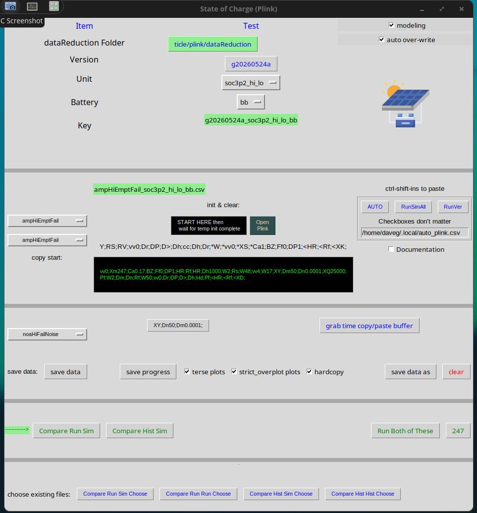

# GUI_PlinkSOC.py Script to Interface to puTTY Serial Monitor

The Particle devices use the Serial interface to stream text-based data files.   This is done real-time with accurate time stamps allowing very accurate debugging.   I perform debugging by overplotting the results with simulated results using the same sampled data inputs.

The user starts [GUI_PlinkSOC.py](../py/GUI_PlinkSOC.py).   Either in the system environment or virtual environment (venv) call Python3.10.10 (lower may work) using the following imports:

```
 python -m pip install --upgrade pip
 python -m pip install configparser
 python -m pip install psutil
 python -m pip install pyperclip
 python -m pip install reportlab
 python -m pip install matplotlib
 python -m pip install easygui
```

Start GUI_PlinkSOC.py.   A gui like this should appear.


 <b>Fig. 1:  Snapshot of Plink Graphical User Interface to Application SOC_Particle</b>

Quick Start:  Install puTTY and puTTY config files (see ../dataReduction/putty/puTTY_Windows_setup_test.odt). Install pyCharm and open 'GUI_PlinkSOC.py' TK window.  Connect device USB to PC.  Press 'Open Plink.'  Wait for puTTY window to open (the Unit needs to match puTTY config file e.g. testsoc3p2 in this example; follow setup instructions for puTTY configuration ).  Type 'talk' commands such as 'Q,' or 'vv5', etc.  Type 'h' for a help menu.   The application will respond with the requested data.

The older 'GUI_TestSOC.py' uses a clumsy puTTY interface that does not support scripting and realtime communication like puTTY Plink does.


TODO:  ...
-none-
