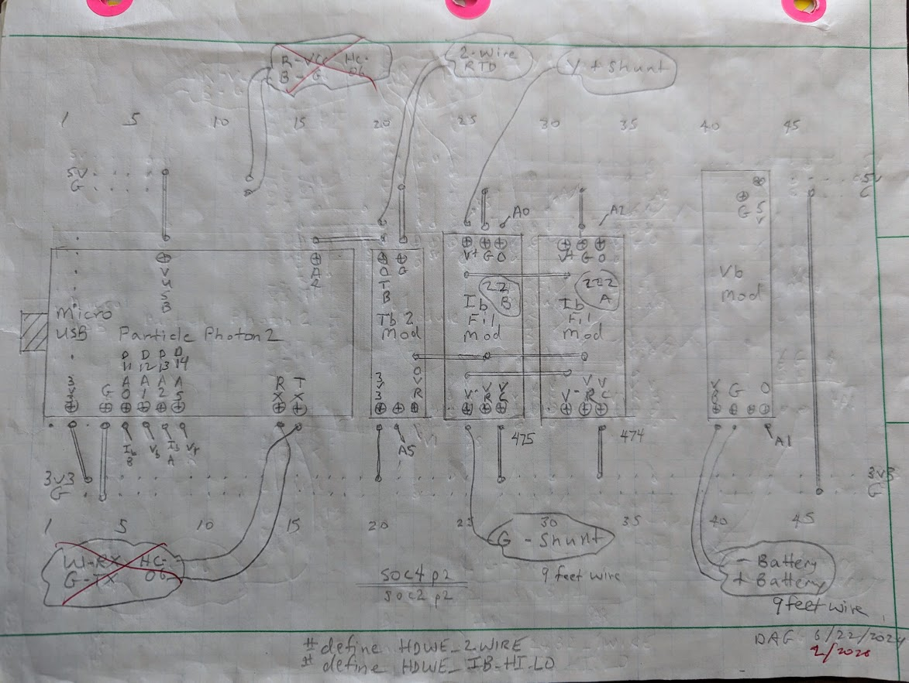
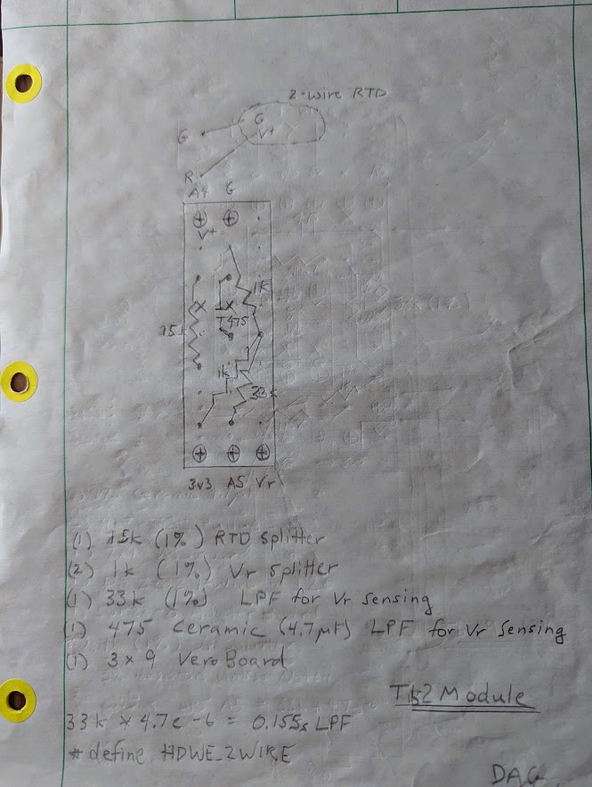
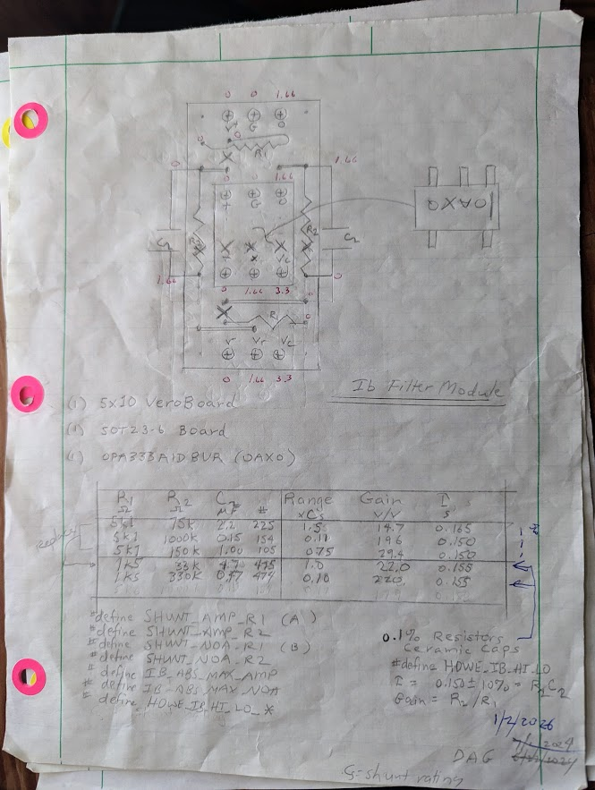
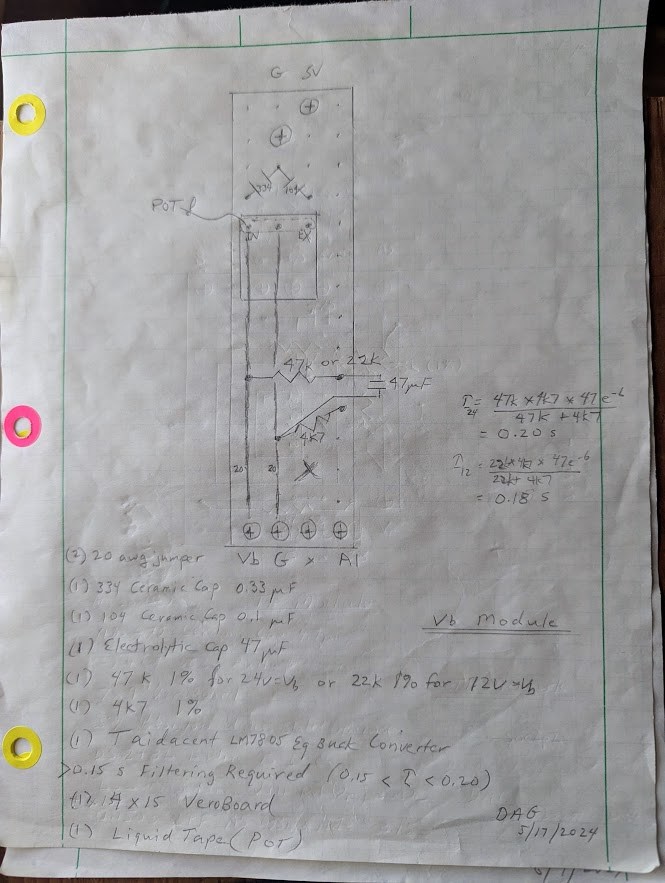

# SOC_Particle — Parts List and Hand Schematics

This document is the markdown reproduction of [parts_list_schematic.ods](parts_list_schematic.ods).
It contains the bill of materials (with working supplier links), the firmware
configuration `#define`s for this hardware combination, alternate
component choices, and the four hand-drawn schematic sketches that were
embedded in the spreadsheet (extracted as PNGs under
[doc/parts_list/](doc/parts_list/)).

For the project overview see [README.md](README.md). For build steps see
[INSTALL.md](INSTALL.md) and the
[Quick Start Guide](README_QuickStart.md).

---

## Bill of Materials

Prices are as recorded in the source spreadsheet. Supplier links open the
specific product pages.

| Part | Supplier | Qty | Unit Price | Shipping | Total |
|------|----------|----:|-----------:|---------:|------:|
| Photon 2 | [Particle](https://store.particle.io/products/photon-2) | 1 | $12.95 | $0.87 | $13.82 |
| OPA333AIDBVR | [Mouser](https://www.mouser.com/ProductDetail/595-OPA333AIDBVR) | 2 | $2.88 | $0.58 | $6.34 |
| 0.1 % Resistors 1 k | [Mouser](https://www.mouser.com/ProductDetail/279-YR1B1K5CC) | 2 | $0.83 | $6.50 | $8.16 |
| 0.1 % Resistors 1 k5 | [Mouser](https://www.mouser.com/ProductDetail/279-YR1B1K5CC) | 4 | $0.54 | $5.00 | $7.16 |
| 0.1 % Resistors 332 k | [Mouser](https://www.mouser.com/ProductDetail/279-YR1B332KCC) | 2 | $0.82 | $5.00 | $6.64 |
| 0.1 % Resistors 33 k2 | [Mouser](https://www.mouser.com/ProductDetail/279-YR1B33K2CC) | 2 | $0.82 | $5.00 | $6.64 |
| Micro USB | [Amazon](https://www.amazon.com/gp/product/B07QD4WVLN/ref=ppx_yo_dt_b_search_asin_title?ie=UTF8&psc=1) | 1 | $4.40 | $0.00 | $4.40 |
| Protoboard | [Amazon](https://smile.amazon.com/Breadboards-Solderless-Breadboard-Distribution-Connecting/dp/B07DL13RZH/ref=sr_1_4?crid=2WMW7QS2JPYLI&keywords=proto+boards&qid=1668677203&sprefix=proto+boards%2Caps%2C79&sr=8-4) | 1 | $2.96 | $0.00 | $2.96 |
| Buck converter | [Amazon](https://www.amazon.com/gp/product/B08FTF527K/ref=ppx_yo_dt_b_search_asin_title?ie=UTF8&psc=1) | 1 | $1.65 | $0.00 | $1.65 |
| VeroBoard | [Amazon](https://www.amazon.com/gp/product/B0073XXWSO/ref=ppx_yo_dt_b_asin_title_o00_s00?ie=UTF8&psc=1) | 1 | $1.10 | $0.00 | $1.10 |
| SOT-23 adapter | [Amazon](https://www.amazon.com/gp/product/B089JY2SJG/ref=ppx_yo_dt_b_search_asin_title?ie=UTF8&psc=1) | 1 | $0.14 | $0.00 | $0.14 |
| Power / shunt wire 18 AWG 4-wire shielded | [Amazon](https://www.amazon.com/gp/product/B01GZ50P7Q/ref=ppx_yo_dt_b_search_asin_title?ie=UTF8&psc=1) | 8 | $0.80 | $0.00 | $6.40 |
| Headers | — | — | — | — | — |
| 1 % Resistors | — | — | — | — | — |
| 1 % Capacitors | — | — | — | — | — |
| Wire bits | — | — | — | — | — |
| 2-wire thermistor | scrounged | — | — | — | — |
| **Grand total** | | | | | **$65.41** |

> Notes from the source spreadsheet:
> - The "0.1 % Resistors 1 k" row links to the same Mouser part as "1 k5"
>   (`279-YR1B1K5CC`). Reproduced as-is; this is likely a copy-paste artefact in
>   the original spreadsheet.
> - Headers, 1 % resistors, 1 % capacitors, and wire bits had no line price in
>   the source — they fold into the rounded $65.41 grand total.

---

## Firmware Configuration

For this hardware combination, set the following in `src/local_config.h`:

```cpp
#define HDWE_PHOTON2
#define HDWE_IB_HI_LO
#define HDWE_2WIRE
```

---

## Alternate / Extra Resistors

Components present in the spreadsheet but not in the primary build:

| Part | Supplier | Unit Price |
|------|----------|-----------:|
| 0.1 % Resistors 150 k | [Mouser](https://www.mouser.com/ProductDetail/279-YR1B150KCC) | $0.82 |
| 0.1 % Resistors 1 M | [Mouser](https://www.mouser.com/ProductDetail/279-YR1B1M0CC) | $0.39 |
| 0.1 % Resistors 5 k62 | [Mouser](https://www.mouser.com/ProductDetail/279-YR1B5K62CC) | $0.54 |

---

## Hand-Drawn Schematic Sketches

These four sketches were embedded in the source spreadsheet. They are the
author's working schematics — informal but the canonical record of what was
actually wired on the breadboard.

### Sketch 1 — Board layout (wide)

Top of the spreadsheet. Wide board-layout view of the prototype build,
breadboard footprint, and connector positions.



### Sketch 2

Sub-circuit detail. Component values and pin-out notes.



### Sketch 3

Sub-circuit detail with op-amp wiring and node annotations.



### Sketch 4

Sub-circuit detail with additional notation and component values.



---

## Source

Source spreadsheet: [parts_list_schematic.ods](parts_list_schematic.ods).
Re-extract images and data with LibreOffice (`soffice --headless --convert-to
csv parts_list_schematic.ods`) and `unzip parts_list_schematic.ods` (images
live in `Pictures/`).
